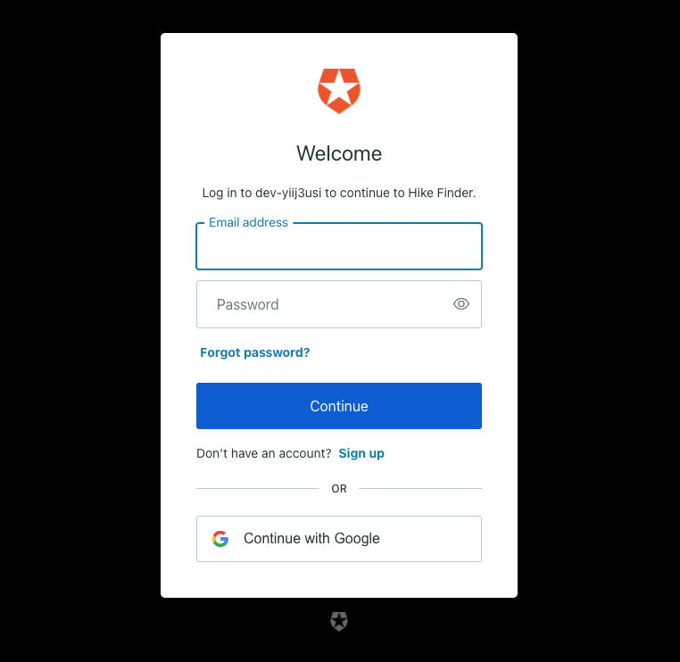
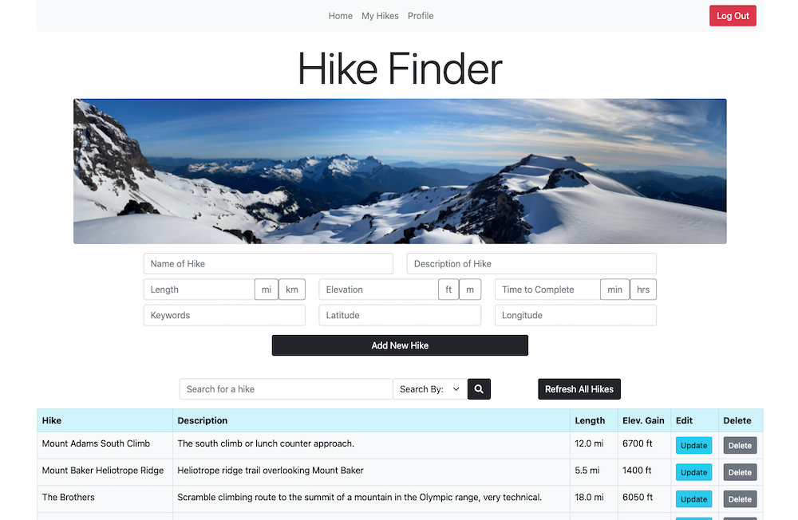

# Hike Finder

Author: Carly Dekock

Link to GitHub repo [here](https://github.com/carlydekock/hike-app)

Deployed Link: [https://hike-finder.netlify.app/](https://hike-finder.netlify.app/)

## Application Info

- Hike Finder is an authenticated hiking trails API.
- Server hosted on Heroku with a PostgreSQL database, and front-end on Netlify
- First, a user must sign in or create an account through Auth0 to gain access to the site.
- Then, a user will have access to the database of local hiking trails.
- Users can view and add to the database, as well as update hike information or remove no longer accessible hikes.
- Can view trip reports from other users on current trail conditions, and can leave trip reports themselves.
- Has a listing of all hikes in the database, and a user's contributed hikes.

## Project Plan: User Stories, DB Schema and Wireframes [here](project-plan.md)

## What You Need

- Auth0 account
- **Server side** .env file should contain:
  - PORT
  - PGUSER
  - PGPASSWORD
  - PGDATABASE
  - PGPORT
  - REACT_APP_AUTH0_DOMAIN
  - REACT_APP_AUTH0_CLIENT_ID
  - CLIENT_ORIGIN
  - REACT_APP_AUTH0_AUDIENCE
  - For mock postgres db testing: SUB
- **Client side** .env file should contain:
  - REACT_APP_AUTH0_DOMAIN
  - REACT_APP_AUTH0_CLIENT_ID
  - REACT_APP_AUTH0_AUDIENCE
- Other dependencies:
  - **Server side**: axios, body-parser, cors, dotenv, express, express-jwt, express-jwt-authz, helmet, jest, jwks-rsa, mock-jwks, morgan, nock, nodemon, pg, supertest
  - **Client side**: axios, cypress, react, react-dom, react-router-dom, @auth0/auth0-react

## Notes on Testing

- Testing files included for server-side Jest testing, client-side Cypress testing and basic react-dom testing
- Some Cypress testing working for deployed site, all working locally due with manual login to Auth0 (troubleshooting errors on passing of user credentials)
- To test locally: change to localhost:3001 in cypress.json file and localhost:3000 in HikeFinder api file

### Main docs for reference troubleshooting

- Auth0 docs [here](https://auth0.com/blog/end-to-end-testing-with-cypress-and-auth0/?_ga=2.244911815.338735673.1632025920-2104252011.1628643904&_gl=1*1odntsq*rollup_ga*MjEwNDI1MjAxMS4xNjI4NjQzOTA0*rollup_ga_F1G3E656YZ*MTYzMjE2NDk5Mi4yMi4wLjE2MzIxNjQ5OTIuNjA)
- Cypress docs [here](https://docs.cypress.io/guides/testing-strategies/auth0-authentication#Auth0-Application-Setup)
- Example spec from Auth0 developer [here](https://github.com/adamjmcgrath/cypress-spa-example/blob/master/cypress/integration/example.spec.js) and [here](https://github.com/danlourenco/auth0-cypress-demo/blob/base/src/App.js), relevant GitHub issues link [here](https://github.com/auth0/auth0-spa-js/issues/581)
- Cypress examples on GitHub [here](https://github.com/cypress-io/cypress-example-recipes/blob/master/examples/logging-in__single-sign-on/cypress/integration/logging-in-single-sign-on-spec.js)
- Cypress testing docs [here](https://docs.cypress.io/api/commands/get), env variables [here](https://docs.cypress.io/guides/guides/environment-variables#Setting)
- Further documentation on authorization code flow from [Auth0](https://auth0.com/docs/login/authentication/add-login-auth-code-flow)
- More info on failed redirects from Cypress Github issues [here](https://github.com/cypress-io/cypress/issues/5919)

## How To Use

1. The home screen will prompt you to login.

1. Once you click login, fill in your credentials or click Sign Up on the Auth0 login screen.

1. Once you've successfully logged in or signed up, you'll be brought to the home screen where you can view hikes information.

## Resources

- Ideas and hike info from [WTA](https://www.wta.org/)
- FreeCodeCamp tutorial on building a fullstack application with React and Node.js [here](https://www.youtube.com/watch?v=J01rYl9T3BU)
- Auth0 documentation and QuickStart guide for React [Single-Page-App](https://auth0.com/docs/quickstart/spa/react)
- React and Auth0 Crash Course and Workshop [video](https://www.youtube.com/watch?v=PYWS-4CXETw&ab_channel=Auth0) by Auth0
- Auth0 SDK for React Single Page Apps [info and docs](https://auth0.github.io/auth0-react/)
- Setting up React context to share user info across site [article](https://www.digitalocean.com/community/tutorials/how-to-share-state-across-react-components-with-context)
- Unit testing token verification for Auth0 using Jest and mock-jwks [article](https://codedaily.io/tutorials/Unit-Test-Token-Verification-for-Auth0-using-Jest-and-mock-jwks)
- Testing PostgreSQL database [here](https://stackoverflow.com/questions/61720872/how-do-you-test-postgres-with-node-js-jest-without-mocking-the-pg-import)
- Mock postgres database for unit testing with jest and supertest [here](https://www.rithmschool.com/courses/intermediate-node-express/api-tests-with-jest)
- Form styling: Bootstrap [docs](https://getbootstrap.com/docs/4.0/layout/grid/)
- Troubleshooting Heroku/PostgreSQL DB connection [StackOverflow](https://stackoverflow.com/questions/47297212/heroku-postgres-add-on-connection-string-for-nodejs-app)
- Deploying a PERN fullstack app from one repo on Heroku and Netlify article [here](https://levelup.gitconnected.com/deploy-pern-fullstack-app-on-heroku-and-netlify-automatic-deploy-9b61ac6a254e)
- Troubleshooting React component testing with router [StackOverflow](https://stackoverflow.com/questions/55552147/invariant-failed-you-should-not-use-route-outside-a-router)
- Cypress testing error message [StackOverflow](https://stackoverflow.com/questions/66378164/referenceerror-process-not-defined-when-executing-cypress-test)
- Cypress and Auth0 testing: [Auth0Blog](https://auth0.com/blog/end-to-end-testing-with-cypress-and-auth0/) and [Cypress Docs](https://docs.cypress.io/guides/testing-strategies/auth0-authentication#Auth0-Application-Setup)
- Cypress and Auth0 login testing troubleshooting: [Auth0 Community Blog](https://community.auth0.com/t/end-to-end-testing-with-cypress-and-auth0/19082/78)
- Cypress testing process not defined error [StackOverflow](https://stackoverflow.com/questions/66378164/referenceerror-process-not-defined-when-executing-cypress-test)
- Cypress end-to-end testing with Auth0 blog [post](https://sandrino.dev/blog/writing-cypress-e2e-tests-with-auth0)
- Cypress app example and end-to-end testing with Cypress documentation [here](https://gist.github.com/kevinold/31dbbebd1cb75f311d798f5bc81574a4)
- Regex to remove quotes for variable used in database query, from [StackOverflow](https://stackoverflow.com/questions/19156148/i-want-to-remove-double-quotes-from-a-string/19156197)
- PostgreSQL [docs](https://www.postgresql.org/docs/current/textsearch-tables.html#TEXTSEARCH-TABLES-SEARCH) for doing a full text search
- Refreshing a page in React from [Upmostly](https://upmostly.com/tutorials/how-to-refresh-a-page-or-component-in-react)

## Tech Used

React, Node.js, Auth0, PostgreSQL, Bootstrap
