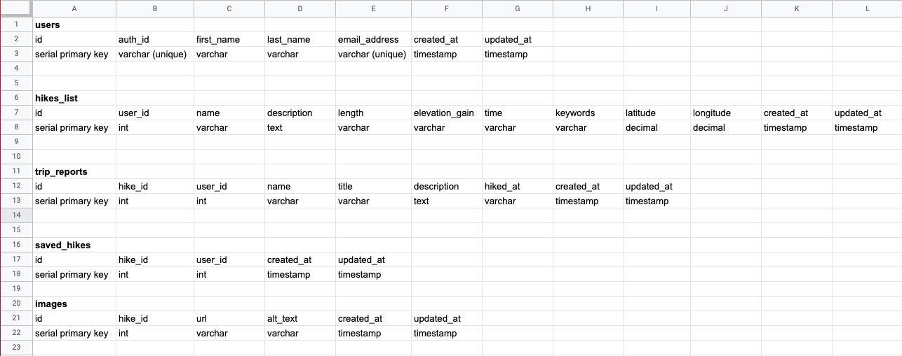
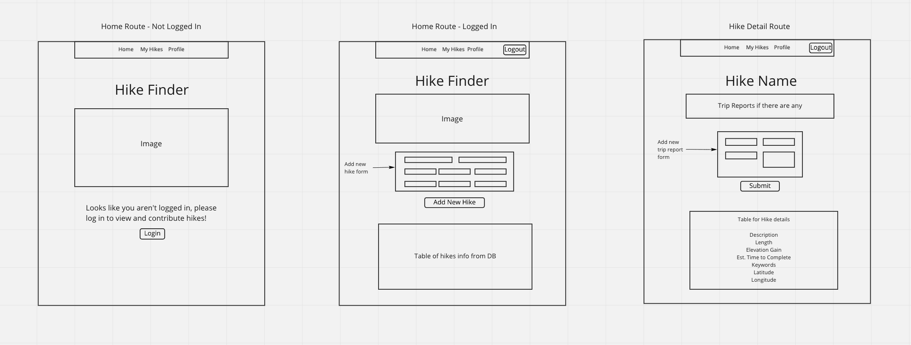

# Project Plan - Hike App

## User Stories

- As a user, I want to be able to view local hikes.
- As a user, I want to be able to create and submit new hikes to add to the list.
- As a user, I want to be able to create a trip report for a given hike.
- As a user, I want to be able to update hike details or delete a no longer accessible hike.
- As a user, I want to be able to search for hikes by name or keywords.
- As a user, I want to see location information for the specified hike.

## Database Info

## API Routes

- Home page: /
  - Authenticated via Auth0, have to be signed into Auth0 to see home route content
  - If not logged in, will see a landing page
- My hikes page: /list
  - Authenticated via Auth0
- Hike detail page: /hikes/:id
  - Contains trip reports
  - To add a trip report: /hikes/:id/addreport
- Update hike details page: /hikes/:id/update
- Delete hike: /hikes/:id
- Auth0 profile information: /profile

## Wireframes

